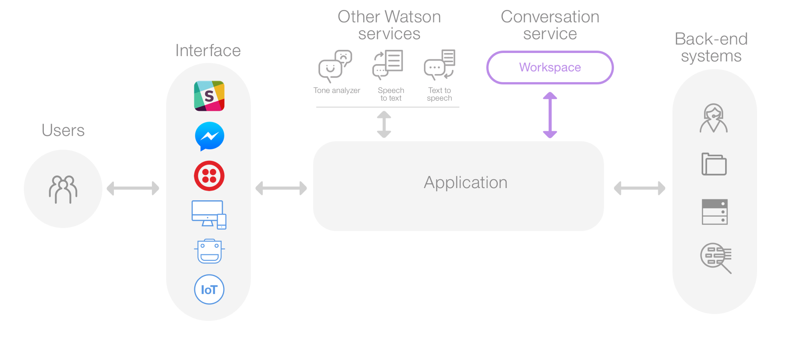
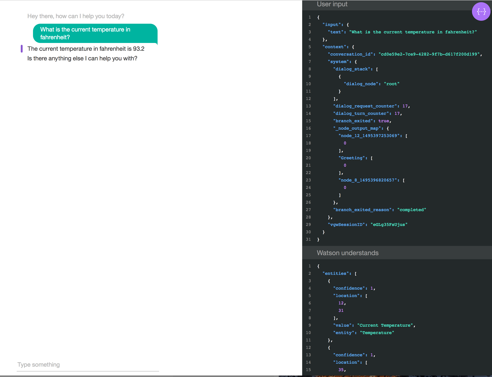

# Web Client for Orchestration Application of Watson Conversation Service
## Introduction
Watson Conversation Service WCS is the Watson service for enabling chat bot functionality.
The chat bots that are developed in WCS are free flowing and can jump around, similar to
how a conversation evolves between to humans. The interactions are like a dialog in the sense
that the user asks questions in any order and answers are provided in response. In some instances
the response is a clarifying questions, which requires the user to provide more information.
In more complex interactions, the response to user questions and responses for clarification
are user specific. Once a response needs to provide user specific information, the logic
and process flow to make that determination needs to be coupled with technology that can 
call other services, outside of WCS, to gather that information. It is in this scenario that
an orchestration application is required. This applicatin is inserted in between the client applications
and the WCS service and watches for signals from WCS and takes action based on those signal.
Below is an architecture view of how this works.

As you can see a user can interact with WCS from many different interfaces or modalities. For example
they can use with a web client, voice client, SMS client. Regardless of which way a user will interact
with WCS, they will go through an orchestration application. 

## Why "this" Web Client
The purpose of this web client is to help in the development of new applications that are designed in WCS
and also make API calls other systems for personalized responses. The main feature of this web client
is the JSON viewer which allows the developer or tester to see what is being sent to WCS in the JSON
payload and what is coming back. This is critical for debugging applications the interact with
systems or services outside of WCS.
Below is an image of the web client.

As you can see on the left side, is the chat bot client. Typical question and answer flow.
On the right side is the JSON viewer. This viewer shows the JSON message being sent from 
the web client "User Input" and the corresponding JSON response "Watson Understands" from 
WCS or the orchestration application.

## Installation
There are two ways you can install the web client application, local and on BlueMix.
### Steps for Local installation
The application has been written in python, so there are some additional packages that will
need to be installed.
1. You need to install the following python package. Open a new command line window
  You can cut and paste each item below on a command line   
	`pip install requests`   
	`pip install flask`   
	`pip install xmltodict`   
	`pip install couchdbkit`   

   The above only take a few minutes
2. Once the above is installed you need to export one or more environment variables:
	- export CONVERSATION_URL=**url of orchestration application**
    
    If your orchestration application's API needs a userid and password in order to call the API, then you need to
    export two more environment variables. 
    - export CONVERSATION_USERNAME=**userid**
    - export CONVERSATION_PASSWORD=**password**
3. At the command line, you can start the application by
	
	`python webclientproxy.py`
	
	You should see the following in the console output:
	
	`2017-05-24 12:16:47,730 - INFO - starting`
	
	`2017-05-24 12:16:47,931 - INFO -  * Running on http://0.0.0.0:5002/ (Press CTRL+C to quit)`
4. Now point your browser to the following URL:

	http://localhost:5002/webclient

At this point you should be up and running in a local environment.

### Steps for BlueMix installation
1. Click the link below

2. Go to the Runtime tab by clicking on the runtime link on the left navigation. In the
center of the page is an option for environment variables. Click on the link. Within the
environment variables are 3 values you need to provide. Once you save, the application will
restart.
